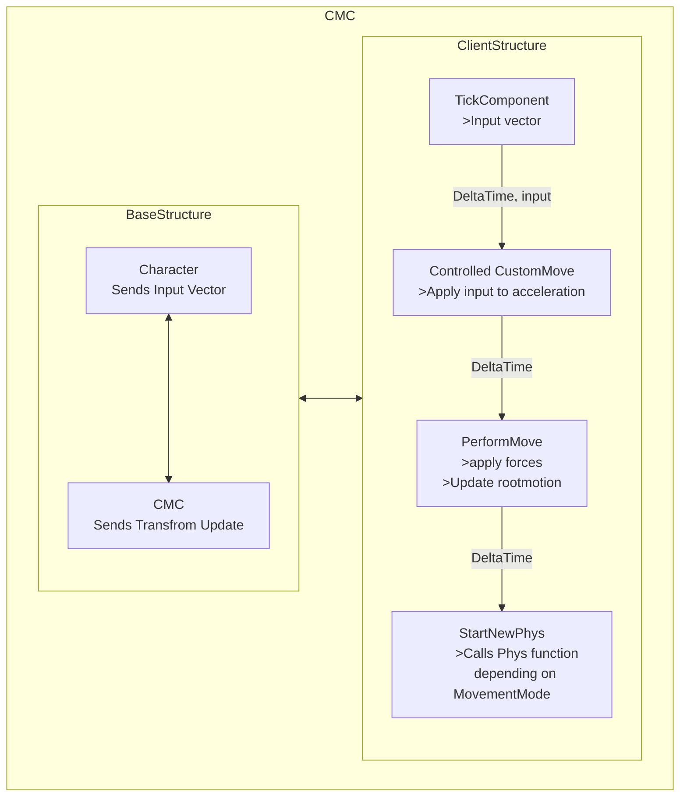
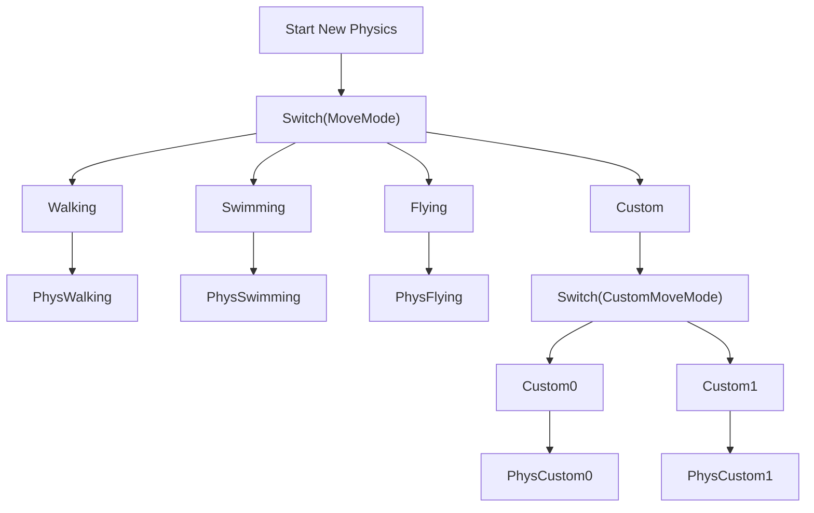
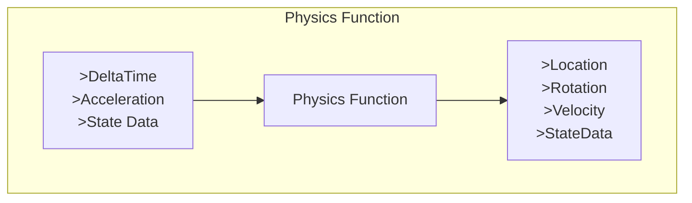

Main features:
- Walk
- Run
- Sprint
- Crouch
- Jump
- Mantle/Vault
- Slide
- Push/Pull Boxes
- Force player in MovementMode //1 bug

#### CMC

CharacterMovementComponent also known as CMC is a built in system in Unreal, that is used by the player to update its position and other movement related logic. You can inherent from the CMC to create your own custom one. This is not necessary but when you are working with custom MovementModes or with a networked game (*the CMC has networking support built in, so you only need to build the logic upon the base, instead of coding everything from scratch*), you will need a custom CMC. It's also recommended if you are planning on adding custom movement to invest early in a robust system for future expendability. I also went this approach to learn more about movement based coding in games and to learn about the system Unreal provides for this.

---

#### Architecture

The character sends an input vector to the CMC, in the CMC the input is put into work and converted to a transform update which in turn is send back to the character where it is applied to the player. When the input is sent to the CMC it has a few steps it goes through, First through the TickComponent the input vector is sent into the system. Then the Deltatime and the Input is applied to the ControlledCustomMove function, in this function the input is applied to the acceleration, this is in turn is send to the PerformMove function, this function is where the movement is applied based on the current MovementMode.
After this the StartNewPhysics function is called. You can read about how the CMC handles this below. 

#### MovementModes & StartNewPhysics
StartNewPhysics has just been called. This will first be send into a switch statement where depending on what MovementMode you're in, the correct Physicsfunction is called. If it detects that you are in a CustomMovementMode, it will again encounter a switch statement, but this time it will switch on the CustomMovementMode. In these physics functions is the place where you can code your own CustomMovementMode. Like for example Sliding, sliding is physically based implemented. The Physics functions are there to update your movement logic on the physicsthread. So the PhysWalking function will calculate and apply the movement to for example the transform of the player.

