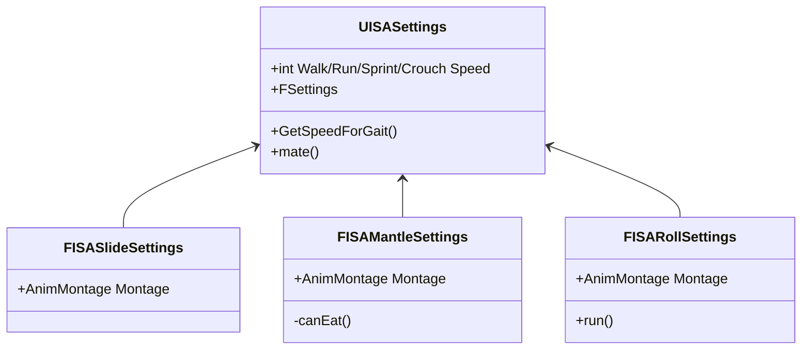

ISASettings is a small DataAsset I coded for the system. Its native in C++ and extended as a blueprint editable class. Its native structure is based around a class, with structs for the designated extra movement settings: Sliding, Mantling and Rolling. These are referenced in the main class. This way I only need to access the one UISASettings class to have access to every setting I added. This is all stored in an UDataAsset. This is an asset which can contain data, this data is easily accessible without having to change C++ code and recompile.  All localized into one simple blueprint container. ![[Pasted image 20230604195648.png]]

